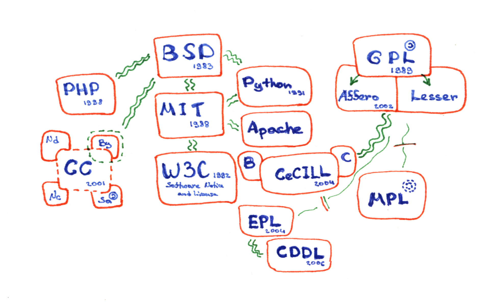
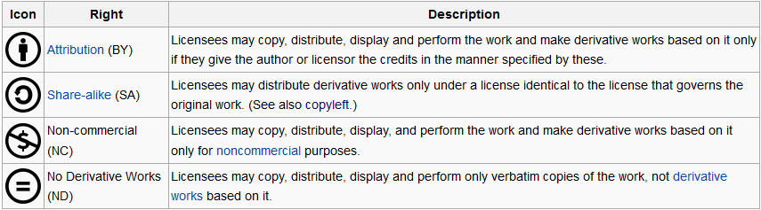
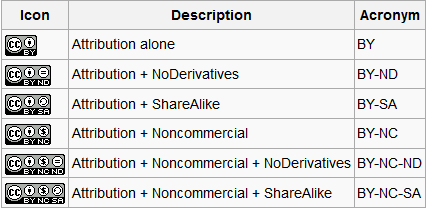

[TOC]

# Unclear
## [DMCA](https://en.wikipedia.org/wiki/DMCA)
[Register to be protected by DMCA](http://www.dmca.com/) have free package and paid package.

## [Fair use](https://en.wikipedia.org/wiki/Fair_use)

## [Google Legal](https://support.google.com/legal/troubleshooter/1114905?rd=1)

# Intellectual Property rights
`Intellectual property (IP) rights` are the legally recognized *exclusive rights* to creations of the mind. Under intellectual property law, owners are granted certain exclusive rights to a variety of *intangible assets*, such as `musical, literary, and artistic works; discoveries and inventions; and words, phrases, symbols, and designs`. Common types of intellectual property rights include `copyright, trademarks, patents, industrial design rights, trade dress,` and in some jurisdictions `trade secrets`.

## Types
### Patents
A patent grants an *inventor* the right to exclude others from making, using, selling, offering to sell, and importing an invention for a limited period of time, in exchange for the public disclosure of the invention. An *invention* is a solution to a specific technological problem, which may be a product or a process.

If not authorization, you cannot follow process is patented. With copyright, you can follow process but not modify or something else if not have right license.

### Trademark
A trademark is a recognizable sign, design or expression which distinguishes products or services of a particular trader from the similar products or services of other traders.

### Copyright
A copyright gives the creator of an original work *exclusive rights* to it, usually for a limited time. Copyright may apply to a wide range of creative, intellectual, or artistic forms, or "works". Copyright does not cover ideas and information themselves, only the form or manner in which they are expressed.

### Copyleft

## Public Domain
Works in the public domain are those whose intellectual property rights have expired, have been forfeited, or are inapplicable. `"many things that cannot be privately owned"`, derivative works without permission from the copyright owner.

----
# [License](http://choosealicense.com/)
The verb `license` means to give permission. The noun `license` refers to that permission as well as to the document recording that permission.

A license may be granted by a party `licensor` to another party `licensee` as an agreement between those parties. Typically included in a *end-user license agreement* (EULA).

[Comparing the open sources licenses](http://choosealicense.com/appendix/)

## Public copyright license/Free license
A `public license` or `public copyright license` is a license by which a licensor can grant additional copyright permissions to licensees and in which either the licensees or both the licensees and licensors are *unlimited*.

A `free license` is a license agreement which contains conditions permitted to the user from the holder on a specific list of uses for his work, which gives him `four major freedoms`.

- *Freedom 0*: The freedom to run the program for any purpose.
- *Freedom 1*: The freedom to study how the program works, and change it to make it do what you wish.
- *Freedom 2*: The freedom to redistribute copies so you can help your neighbor.
- *Freedom 3*: The freedom to improve the program, and release your improvements (and modified versions in general) to the public, so that the whole community benefits.

### Classification
- Agreement, which is related to the [public domain](#public-domain)
    + [Creative Commons' CC0](http://en.wikipedia.org/wiki/CC0)
- [Permissive licenses](http://en.wikipedia.org/wiki/Permissive_license)
    + [BSD License](http://en.wikipedia.org/wiki/BSD_License)
    + [MIT License](http://en.wikipedia.org/wiki/MIT_License)
    + [Mozilla Public License](http://en.wikipedia.org/wiki/Mozilla_Public_License)
    + [Creative Commons Attribution](http://en.wikipedia.org/wiki/Creative_Commons_Attribution)
- [Copyleft licenses](http://en.wikipedia.org/wiki/Copyleft_license)
    + [GNU GPL](http://en.wikipedia.org/wiki/GNU_GPL), [LGPL](http://en.wikipedia.org/wiki/GNU_LGPL) (weaker copyleft), [AGPL](http://en.wikipedia.org/wiki/GNU_AGPL) (stronger copyleft)
    + [Creative Commons Attribution Share-Alike](http://en.wikipedia.org/wiki/Creative_Commons_Attribution_Share-Alike)
    + [GFDL](http://en.wikipedia.org/wiki/GFDL)

License Diagram

### Creative Commons licenses
`Creative Commons licenses` are explicitly identified as *public licenses*. Any person can apply a Creative Commons license to their work, and any person can take advantage of the license to use the licensed work according to the terms and conditions of the relevant license.

#### Type of licenses
Baseline right

Regular licenses

#### Public domain
`CC0` - “No Rights Reserved”

`Public Domain Mark` - “No Known Copyright”

## Software license
Software categories

### [GNU General Public License](https://gnu.org/licenses/gpl.html)

## Problems
### License compatibility
License compatibility is an issue that arises when licenses applied to copyrighted works, particularly licenses of software packages, can contain contradictory requirements, rendering it impossible to combine source code or content from such works in order to create new ones.

>Suppose a software package has a license that says, "modified versions must mention the developers in any advertising materials," and another package's license says "modified versions cannot contain additional attribution requirements." Without direct permission from the copyright holder(s) for at least one of the two packages, it would be impossible to legally distribute a combination of the two because these specific license requirements cannot be simultaneously fulfilled. Thus, these two packages would be license-incompatible.
