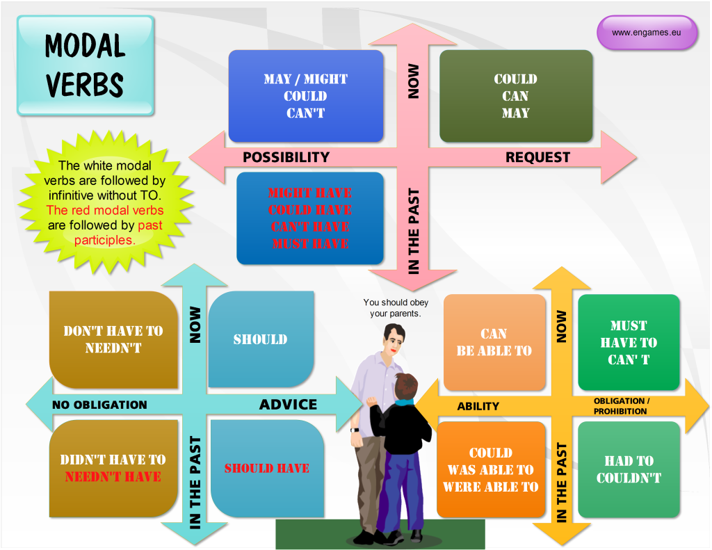

[TOC]

# Overview

English grammar.

# Modal verbs

## Past modal verbs - could have, should have, would have

### could have + past participle

- could have + past participle means that something was possible in the
  past, or you had the ability to do something in the past, but that you
  didn't do it.
    + I could have stayed up late, but I decided to go to bed early.
    + They could have won the race, but they didn't try hard enough.
    + Julie could have bought the book, but she borrowed it from the
      library instead.
    + He could have studied harder, but he was too lazy and that's why
      he failed the exam.
- coudn't have + past participle means that something wasn't possible in
  the past, even if you had wanted to do it.
    + I couldn't have arrived any earlier. There was a terrible traffic
      jam.
    + He couldn't have passed the exam, even if he had studied harder.
      It's a really, really difficult exam.
- we want to make a guess about something that happened in the past. In
  this case, we don't know if what we're saying is true or not true.
  We're just talking about our opinion of what maybe happened.
    + Why is John late? He could have got stuck in traffic.
    + He could have forgotten that we were meeting today.
    + He could have overslept.
- We can also choose to use `might have + past participle` to make a
  guess about something that happened in the past.
    + He might have got stuck in traffic
    + He might have forgotten that we were meeting today.
    + He might have got stuck in traffic.

### Should have + past participle

- `should have + past participle` can mean something that would have
  been a good idea, but that you didn't do it. It's like giving advice
  about the past when you say it to someone else, or regretting what you
  did or didn't do when you're talking about yourself.
    + I should have studied harder! (= I didn't study very hard and so I
      failed the exam. I'm sorry about this now.)
    + I should have gone to bed early (= I didn't got to bed early and
      now I'm tired.)
- `shouldn't have + past participle` means that something wasn't a good
  idea, but you did it anyway.
    + I shouldn't have eaten so much cake! (= I did eat a lot of cake
      and now i don't feel good.)
- `should have + past participle` to talk about something that, if
  everything is normal and okay, we think has already happened. But
  we're not certain that everything is fine, so we use 'should have' and
  not the present perfect or past simple. It's often used with 'by now'.
    + His plane should have arrived by now (= if everything is fine, the
      plane has arrived).
    + John should have finished work by now (= if everything is normal,
      John has finished work).
    + Lucy should have arrived by now, but she hasn't.

### would have + past participle

- part of the `third conditional`
    + If I had had enough money, I would have bought a car (but I didn't
      have enough money, so I didn't buy a car).
- to talk about something you wanted to do but didn't
    + I would have gone to the party, but I was really busy. (= I wanted
      to go to the party, but I didn't because I was busy. If I hadn't
      been so busy, I would have gone to the party.)
    + I would have called you, but I didn't know your number. (= I
      wanted to call you but I didn't know your number, so I didn't call
      you.)
    + A: Nobody volunteered to help us with the fair
    + B: I would have helped you. I didn't know you needed help. (= If I
      had known that you needed help, I would have helped you.)

# Comparative/Superlative

- [Comparative/Superlative][comparative-superlative]

# Indefinite pronoun

- [Wikipedia - Indefinite Pronoun][indefinite-pronoun]
- [Indefinite Pronoun][indefinite-pronoun-1]

# Infinitives as Subjects

- [Infinitives as Subjects][infinitive-as-subject]

# Adjectives

- We use adjectives to describe nouns.
- Most adjectives can be used in front of a noun:

> They have a **beautiful** house.
> We saw a very **exciting** film last night.

or after a link verb like be, look or feel:

> Their house is **beautiful**.
> That film looks **interesting**.

## Noun modifiers

- We often use two nouns together to show that one thing is a part of
  something else:

>the village church; the car door; the kitchen window; the chair leg;
my coat pocket; London residents

- We can use noun modifiers to show what something is made of:

> a gold watch; a leather purse; a metal box

- We often use noun modifiers with nouns ending in `-er` and `-ing`:

> an office worker; a jewellery maker; a potato peeler; a shopping list;
> a swimming lesson; a walking holiday.

- We use measurements, **age** or **value** as noun modifiers:

> a thirty kilogram suitcase; a two minute rest; a five thousand euro
> platinum watch; a fifty kilometre journey;

- We often put two nouns together and readers/listeners have work out
  what they mean. So:

> an ice bucket = a bucket to keep ice in
an ice cube = a cube made of ice
an ice breaker = a ship which breaks ice
the ice age = the time when much of the Earth was covered in ice.

- Sometimes we find more than two nouns together:

> London office workers; grammar practice exercises

- Noun modifiers come after adjectives:

> The old newspaper seller
A tiring fifty kilometre journey

## Adjectives: -ed and -ing

A lot of adjectives are made from verbs by adding -ing or -ed:

### -ing adjectives

The commonest -ing adjectives are: amusing, shocking, surprising,
frightening, interesting, disappointing, exciting tiring, worrying,
boring, terrifying, annoying.

> If you call something *interesting* you mean it *interests* you.
> If you call something *frightening* you mean it *frightens* you.

    I read a very **interesting** article in the newspaper today.
    That Dracula film was absolutely **terrifying**.

### -ed adjectives

The commonest -ed adjectives are: annoyed, bored, frightened, worried,
tired, closed, excited, delighted, disappointed.

> If something *annoys* you, you can say you feel *annoyed*.
> If something *interests* you, you can say you are *interested*.

    The children had nothing to do. They were **bored**.

# References

1. [English Grammar - British Council][1]

[1]: https://learnenglish.britishcouncil.org/en/english-grammar "English Grammar - British Council"
[comparative-superlative]: http://esl.fis.edu/grammar/rules/comp.htm "Comparative/Superlative"
[indefinite-pronoun]: https://en.wikipedia.org/wiki/Indefinite_pronoun "Wikipedia - Indefinite Pronoun"
[infinitive-as-subject]: http://www.grammar-quizzes.com/infinitive1.html "Infinitives as Subjects"
[indefinite-pronoun-1]: http://www.k12reader.com/term/indefinite-pronouns/ "Indefinite Pronoun"
