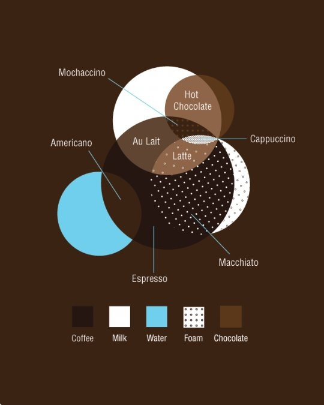

[TOC]

# Overview
**Coffee** is **a brewed drink** prepared from **roasted coffee beans**, which are the seeds of berries from the Coffea plant.

**Coffea** is a genus of flowering plants whose *seeds*, called *coffee beans*, are used to make coffee.

A **coffee bean** is a *seed* of the coffee plant, and is the source for coffee

The bean belt in yellow; the 20 largest producers (2011) in green

The two most commonly grown are the highly regarded **arabica**, and the less sophisticated but stronger and more hardy **robusta**.

Once ripe, coffee beans are picked, processed, and dried.

Green (unroasted) coffee beans are one of the most traded agricultural commodities in the world. Once traded, the coffee beans are roasted to varying degrees, depending on the desired flavor. Roasted beans are ground and brewed to produce coffee as a beverage.

# Types
## Espresso base
Espresso based, invented mechanically in the late 19th century in Italy and gaining popularity in the early 20th is a way of extracting a great amount of coffee oils and other ingredients from the coffee bean without actually ingesting the fibrous material of the bean itself.

## Caffetiera
Caffetiera - also known as Machinetta or Moka pot - is a home favourite in Europe and Cuba, gaining popularity in South America and Israel. It produces a taste similar to espresso (in my opinion - your mileage may vary) and is easy and fast to make and clean.

## Drip coffee
Drip coffee - the American favourite, made using a filter machine. While boasting a huge fanbase, coffee lovers usually find it extremely weak, watery and bitter. Popular in the US, central America and some countries in South America (esp. Argentina and Uruguay).

## Turkish or Arabic coffee
Turkish or Arabic coffee - either "simply" pouring hot water onto crushed beans and waiting for them to sink or the elaborate triple boiling of crushed beans with water and sugar in a traditional pot called the finjan.

## French press
French press - a device used to manually filter the coffee, noted for allowing more of the coffee oils into the beverage and therefore more aromatic and rich in flavour but watery in texture.

## Vietnamese coffee
Thai and Vietnamese Iced Coffee are different from one another, but the lines between them are blurry because Thai Iced Tea is a lot like Vietnamese Iced Coffee.

# Coffeemaker
## Drip Coffee Makers

## Espresso Coffee Machines

## French Presses

## Single Cup Makers
