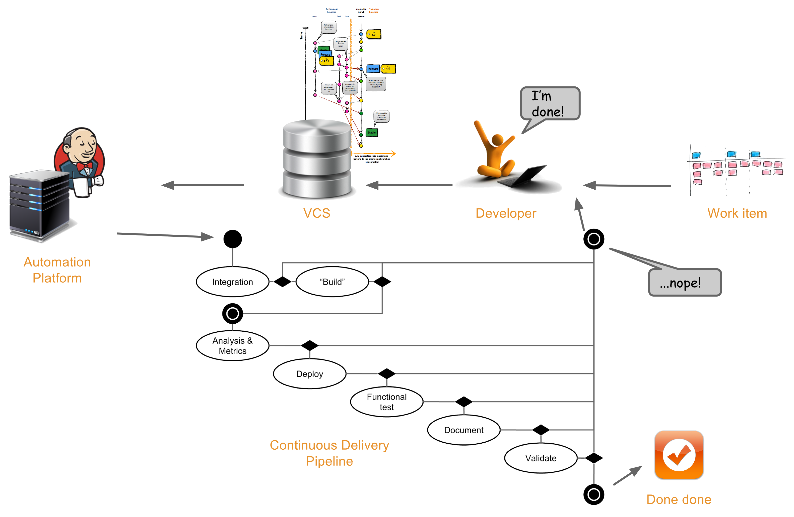

[TOC]

# [Overview](https://en.wikipedia.org/wiki/Software_development_process)
- Core activities
	+ Requirements
	+ Design
	+ Construction (Coding)
	+ Testing
	+ Debugging
	+ Deployment
	+ Maintenance

- Methodologies

- Supporting disciplines

- Tools

# Terminology
## [DevOps](https://en.wikipedia.org/wiki/DevOps)

# Community Learning
- [Slant](http://www.slant.co/): Slant lets you quickly see which options are the most popular and why you should pick one over the other.
- [StackOverflow](http://stackoverflow.com/)
- [Github](https://github.com/)
- [Reddit](https://www.reddit.com/)
- [Quora](https://www.quora.com/)
- [Wikipedia](https://en.wikipedia.org/wiki/Main_Page)

# Deployment
- [Continuous Integration, Continuous Deployment and Continuous Delivery](http://stackoverflow.com/questions/28608015/continuous-integration-vs-continuous-delivery-vs-continuous-deployment)

## [Continuous Integration](http://martinfowler.com/articles/continuousIntegration.html)
### Hosted Services
- [Circle CI](https://circleci.com/)
- [Travis CI](https://travis-ci.org/)
- [Wercker](http://wercker.com/): using it because unlimited private repositories.

## Continuous Deployment
- [Codeship](https://codeship.com/)

## Continuous Delivery
http://continuousdelivery.com/

# Tools
- [Open Source Scrum project management](https://github.com/taigaio)
- [Example of company guide](https://github.com/thoughtbot/guides)
