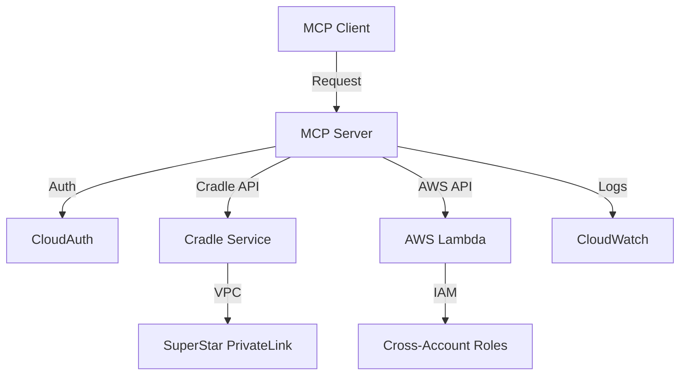

# MCP Server Development Guide: Cradle & AWS Lambda Integration

## Project Overview

This guide provides a comprehensive plan for building a custom Model Context Protocol (MCP) server with tools to interact with Amazon's internal Cradle system and AWS Lambda functions, following established patterns from Amazon's internal MCP ecosystem.

## Architecture & Technology Stack

### Core Components

1. **MCP Server Framework**: Python with FastMCP library
2. **Authentication**: Amazon Midway/CloudAuth integration 
3. **Internal Systems**: Cradle ETL platform APIs
4. **AWS Services**: Lambda functions, CloudWatch, IAM
5. **Deployment**: Local development → Internal Amazon deployment

### Technology Stack Details

```python
# Core Dependencies
FastMCP           # MCP server framework
boto3            # AWS SDK for Python
requests         # HTTP client for internal APIs
pydantic         # Data validation and settings
structlog        # Structured logging
```

## Implementation Plan

### Phase 1: Foundation Setup (Week 1-2)

#### 1.1 Development Environment
- Set up Python development environment with FastMCP
- Install Amazon internal tooling (`toolbox install amzn-mcp`)
- Configure authentication (Midway/CloudAuth)
- Set up VPC connectivity for internal service access

#### 1.2 Basic MCP Server Structure
```python
from mcp.server.fastmcp import FastMCP
import structlog

mcp = FastMCP("Cradle-Lambda-MCP-Server")
logger = structlog.get_logger()

@mcp.tool()
def health_check() -> str:
    """Basic health check for MCP server"""
    return "Server is healthy"
```

- Create FastMCP server with basic health check
- Implement authentication middleware
- Set up logging and error handling
- Create configuration management system

### Phase 2: Cradle Integration (Week 2-4)

#### 2.1 Cradle API Integration

**Prerequisites:**
- AAA application registration
- CloudAuth client setup
- VPC connectivity via SuperStar
- Cradle account creation (dev + prod)

**Authentication Flow:**
```python
import requests
from typing import Dict, Any

class CradleClient:
    def __init__(self, account_name: str, environment: str):
        self.account = account_name
        self.env = environment
        self.auth_token = self._get_auth_token()
    
    def _get_auth_token(self) -> str:
        # CloudAuth integration for token retrieval
        pass
```

#### 2.2 Cradle MCP Tools

```python
@mcp.tool()
def cradle_create_profile(
    name: str,
    query_type: str,
    sql_query: str = None,
    scala_code: str = None,
    python_code: str = None
) -> Dict[str, Any]:
    """Create new Cradle profile (SQL/Scala/Python)"""
    pass

@mcp.tool()
def cradle_run_job(
    profile_name: str,
    parameters: Dict[str, Any] = None
) -> Dict[str, Any]:
    """Execute Cradle job with parameters"""
    pass

@mcp.tool()
def cradle_get_status(job_id: str) -> Dict[str, Any]:
    """Monitor job execution status"""
    pass

@mcp.tool()
def cradle_get_results(job_id: str) -> Dict[str, Any]:
    """Retrieve job outputs and logs"""
    pass

@mcp.tool()
def cradle_list_profiles() -> List[Dict[str, Any]]:
    """Browse available profiles"""
    pass
```

### Phase 3: AWS Lambda Integration (Week 3-5)

#### 3.1 Lambda API Integration

```python
import boto3
from botocore.exceptions import ClientError

class LambdaClient:
    def __init__(self, region: str = 'us-west-2'):
        self.client = boto3.client('lambda', region_name=region)
        self.logs_client = boto3.client('logs', region_name=region)
```

#### 3.2 Lambda MCP Tools

```python
@mcp.tool()
def lambda_create_function(
    function_name: str,
    runtime: str,
    handler: str,
    code: str,
    role_arn: str,
    environment_vars: Dict[str, str] = None
) -> Dict[str, Any]:
    """Deploy new Lambda function"""
    pass

@mcp.tool()
def lambda_invoke(
    function_name: str,
    payload: Dict[str, Any] = None,
    invocation_type: str = "RequestResponse"
) -> Dict[str, Any]:
    """Execute Lambda function with payload"""
    pass

@mcp.tool()
def lambda_get_logs(
    function_name: str,
    start_time: str = None,
    end_time: str = None
) -> List[str]:
    """Retrieve CloudWatch logs"""
    pass

@mcp.tool()
def lambda_update_code(
    function_name: str,
    code: str
) -> Dict[str, Any]:
    """Update function code"""
    pass

@mcp.tool()
def lambda_list_functions() -> List[Dict[str, Any]]:
    """Browse Lambda functions"""
    pass
```

### Phase 4: Advanced Features (Week 5-6)

#### 4.1 Orchestration Tools

```python
@mcp.tool()
def cradle_lambda_pipeline(
    cradle_profile: str,
    lambda_function: str,
    trigger_condition: str = "completion"
) -> Dict[str, Any]:
    """Chain Cradle jobs with Lambda triggers"""
    pass

@mcp.tool()
def monitor_job_pipeline(pipeline_id: str) -> Dict[str, Any]:
    """Track multi-step workflows"""
    pass

@mcp.tool()
def schedule_recurring_job(
    job_config: Dict[str, Any],
    schedule: str
) -> Dict[str, Any]:
    """Set up automated schedules"""
    pass
```

#### 4.2 Data Flow Integration

- S3 dependency checking
- Andes table integration
- EDX data pipeline connections

### Phase 5: Testing & Documentation (Week 6-7)

#### 5.1 Testing Strategy

```python
import pytest
from unittest.mock import Mock, patch

class TestCradleTools:
    def test_cradle_create_profile(self):
        # Unit test for profile creation
        pass
    
    def test_cradle_run_job(self):
        # Unit test for job execution
        pass

class TestLambdaTools:
    def test_lambda_invoke(self):
        # Unit test for Lambda invocation
        pass
```

#### 5.2 Integration Tests

- Live Cradle service testing
- Lambda function deployment and execution
- Error handling and edge cases

## Security & Compliance

### Authentication Requirements
- **Midway Integration**: Primary authentication mechanism
- **CloudAuth**: Token management and validation
- **AAA Application**: Service registration and relationships

### Authorization Patterns
```python
class SecurityMiddleware:
    def __init__(self):
        self.auth_client = CloudAuthClient()
    
    def validate_request(self, request) -> bool:
        token = self.extract_token(request)
        return self.auth_client.validate_token(token)
```

### Data Security
- Encrypted connections for all API calls
- No credential storage in application code
- Audit logging for all operations
- VPC isolation for internal service access

## Dependencies & Prerequisites

### Internal Amazon Dependencies
- **Cradle Service Access**: API credentials and VPC connectivity
- **AAA Application Setup**: Service registration and relationships
- **CloudAuth Onboarding**: Client registration and token management
- **SuperStar CDK**: PrivateLink connectivity management

### AWS Dependencies
- **Lambda Permissions**: Function creation and execution rights
- **CloudWatch Access**: Log retrieval and monitoring
- **IAM Roles**: Cross-account access configuration
- **VPC Configuration**: Network isolation and security

### Development Dependencies
```requirements.txt
fastmcp>=0.2.0
boto3>=1.34.0
requests>=2.31.0
pydantic>=2.5.0
structlog>=23.2.0
pytest>=7.4.0
pytest-asyncio>=0.21.0
moto>=4.2.0  # AWS mocking for tests
```

## Configuration Management

```yaml
# config.yaml
server:
  name: "cradle-lambda-mcp-server"
  version: "1.0.0"
  log_level: "INFO"

cradle:
  dev_account: "team-cradle-dev"
  prod_account: "team-cradle-prod"
  api_endpoint: "https://cradle.corp.amazon.com/api"
  
aws:
  regions: ["us-west-2", "us-east-1"]
  lambda_timeout: 300
  
authentication:
  cloudauth_endpoint: "https://cloudauth.corp.amazon.com"
  aaa_application: "your-mcp-server"
```

## Deployment Architecture



## Success Metrics

### Performance Targets
- **Response Time**: <2s for status queries
- **Concurrent Operations**: Support 5+ simultaneous jobs
- **Uptime**: 99%+ availability
- **Error Rate**: <1% for API calls

### Functional Requirements
- Successfully create and execute Cradle jobs via MCP tools
- Deploy and invoke Lambda functions through MCP interface
- Real-time job monitoring and status reporting
- Comprehensive error handling and recovery

## Common Usage Patterns

### Example 1: Data Pipeline with Lambda Processing

```python
# Create Cradle profile for data extraction
cradle_create_profile(
    name="customer-data-extract",
    query_type="sql",
    sql_query="SELECT * FROM customer_table WHERE date = '2024-01-01'"
)

# Run the Cradle job
job_result = cradle_run_job("customer-data-extract")

# Process results with Lambda
lambda_invoke(
    function_name="process-customer-data",
    payload={"cradle_job_id": job_result["job_id"]}
)
```

### Example 2: Automated Monitoring Pipeline

```python
# Set up recurring job
schedule_recurring_job(
    job_config={
        "cradle_profile": "daily-metrics",
        "lambda_function": "alert-processor"
    },
    schedule="0 8 * * *"  # Daily at 8 AM
)
```

## Troubleshooting Guide

### Common Issues

1. **Authentication Failures**
   - Verify CloudAuth token validity
   - Check AAA application relationships
   - Validate VPC connectivity

2. **Cradle Job Failures**
   - Review job logs in Cradle UI
   - Check input data availability
   - Verify profile configuration

3. **Lambda Invocation Errors**
   - Validate IAM permissions
   - Check function timeout settings
   - Review CloudWatch logs

### Debugging Tools

```python
@mcp.tool()
def debug_connectivity() -> Dict[str, Any]:
    """Test connectivity to all services"""
    results = {
        "cradle": test_cradle_connection(),
        "lambda": test_lambda_connection(),
        "cloudauth": test_auth_connection()
    }
    return results
```

## Future Enhancements

### Planned Features
- **UI Integration**: Web interface for job management
- **Advanced Scheduling**: Complex dependency workflows
- **Multi-Region Support**: Cross-region job execution
- **Performance Analytics**: Job execution metrics and optimization

### Integration Opportunities
- **Step Functions**: Serverless workflow orchestration
- **EventBridge**: Event-driven job triggering
- **SQS/SNS**: Asynchronous job processing
- **S3 Events**: Data availability triggers

## Conclusion

This MCP server provides a powerful interface for integrating Amazon's internal Cradle ETL platform with AWS Lambda functions. By following this implementation guide, you can create a robust, secure, and scalable solution that leverages the best of both internal Amazon tools and AWS cloud services.

The modular architecture ensures easy maintenance and future enhancements, while the comprehensive testing strategy guarantees reliability in production environments.